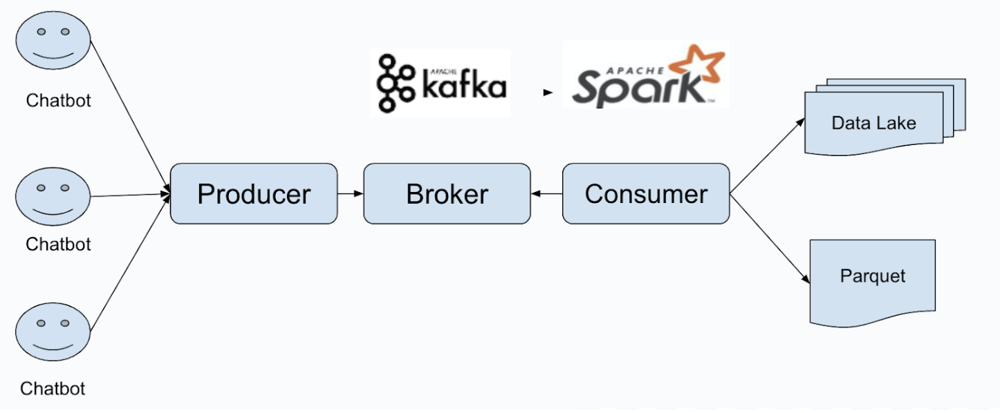

# Project Background
With an aging population, the emotional health of seniors is becoming increasingly important. Unmet emotional needs can lead to depression and other mental health issues. Our goal is to utilize AI and IoT technologies to create a platform that promotes emotional well-being through story sharing and emotional monitoring.

## Photo Collection and Story Sharing
Collect a series of photos related to seniors, which can include family moments, community events, or nature scenes.
Use these photos to tell stories that trigger seniors' memories, fostering social interaction.

## Chatbot Interaction
Design a chatbot that engages seniors in conversation, encouraging them to share their own stories and feelings.
Leverage a small language model : Ollama  to understand and generate natural language, facilitating emotion recognition and feedback on a local device.

## Emotional Monitoring
Analyze the chatbot's conversation content to identify emotional changes in seniors (e.g., happiness, sadness, anxiety).
Employ edge computing to process data on devices, allowing real-time emotion detection and reducing latency.

## Data Processing and Analysis
Utilize Apache Spark to process and analyze the collected data, including user stories and emotional feedback, generating insightful reports.
Implement Kafka as a data streaming medium to enable real-time data transmission and processing within the system.

## Expected Outcomes
Enhance seniors' emotional well-being, reducing feelings of loneliness and symptoms of depression.
Collect and analyze emotional data, providing key insights to support future research and health interventions.
Promote intergenerational communication and strengthen family and community bonds.

# System overview


# Disaster Recovery and Data Analytics for Kafka and Spark

## Local Data Buffering

To implement local data buffering, you can modify the `kafka-console-producer.sh` script in the `kafka_*/bin/` directory. The script should be updated to configure the Kafka producer properties to ensure reliable message delivery and efficient compression.

### Modify `kafka-console-producer.sh`

```bash
exec $(dirname $0)/kafka-run-class.sh kafka.tools.ConsoleProducer \
  --broker-list 54.218.116.15:9092 \
  --topic iotmsgs-vivian \
  --producer-property acks=all \
  --producer-property compression.type=gzip \
  --producer-property linger.ms=10 \
  --producer-property batch.size=16384 \
  --producer-property buffer.memory=33554432 \
  --producer-property retries=3
```

## Data Skew

To mitigate data skew in a Kafka-based system, it's recommended to set the partition key based on user geographic location (such as region or city). This approach ensures more even data distribution across Kafka partitions, particularly in situations where customer numbers or activity levels are uneven across regions.

### Why Geographic Partitioning Helps

Using the user's geographic region as a partition key ensures that messages related to different regions are distributed across different partitions, avoiding situations where a particular partition becomes overloaded due to an uneven distribution of customer activity.

---

# Data Analytics with Kafka and Spark

This document provides insights into **data analytics** using **Apache Spark** for real-time data analysis and the use of **Kafka** for streaming data. The content focuses on performing analytics on the data using SQL queries in Spark, and saving the results to **Parquet** files for efficient storage.

## 1. Data Analytics with Spark

### Using `spark.sql()` for Data Querying

Apache Spark allows you to execute SQL queries on structured data using the `spark.sql()` method. The results of the query are typically stored in memory for the duration of the session, making it ideal for real-time analysis.

#### Example Query to Analyze Sentiment Scores

```python
spark.sql("""
  SELECT payload.data.region AS region, 
         COUNT(payload.data.sentiment_score) AS negative 
  FROM iotmsgs_table 
  WHERE payload.data.sentiment_score < 0 
  GROUP BY payload.data.region
""").show(n=100)
```

### Writing Kafka Query Results to Parquet
Once you query the data from Kafka, you may want to persist the results to Parquet files for efficient storage.
```python
result_df = spark.sql("""
  SELECT payload.data.region AS region, 
         COUNT(payload.data.sentiment_score) AS negative 
  FROM iotmsgs_table 
  WHERE payload.data.sentiment_score < 0 
  GROUP BY payload.data.region
""")

# Define the output path for the Parquet file
output_path = "path/to/output_directory"

# Write the result DataFrame to Parquet format, overwriting any existing data
result_df.write.mode("overwrite").parquet(output_path)

```
